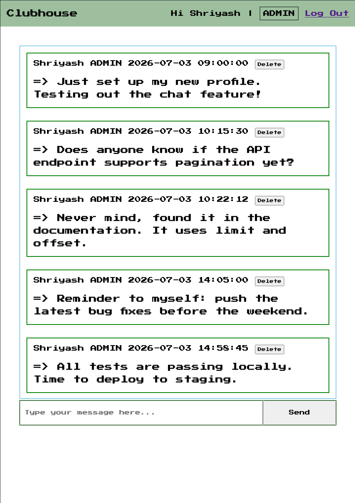

## Clubhouse

An _super secret_ underground messaging platform that let's anyone read the messages. Members(authenticated users) can send messages to the chat, however they cannot see who/what time the message was posted. However you can sign up to be a VIP by using the secret code that let's you see the author/ and time of the messages that are posted.

Likewise, I as an admin can delete any mesages I want. hahaahah, powerr moves right there.

This is an SSR applicartion made using PostgreSQL for data storage, express-validator for validating user input, express-session for session management, and passport for authentication and pg-connect-simple for session storage.
